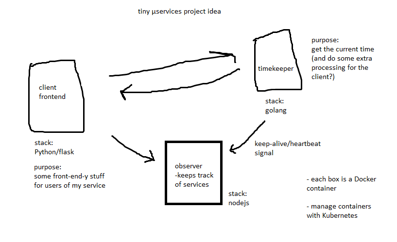

# mu-services    
exploring microservices with Docker, a bunch of languages and k8s    
    
currently just a playground with no real direction or good organization :)    
the Docker images of each application should work out-of-the-box at least though (after you build them).    
    
see my intended idea below:    
